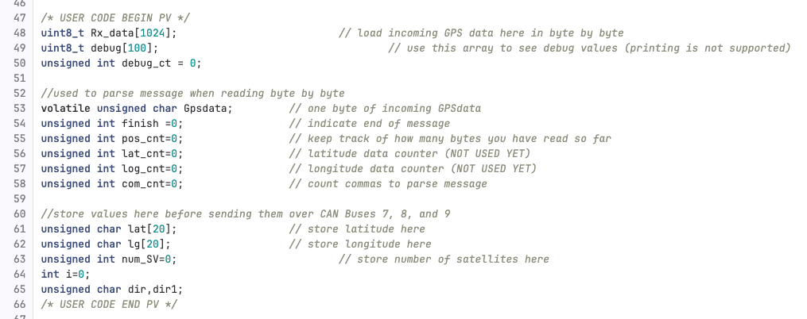
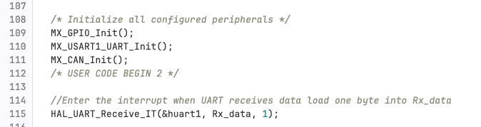
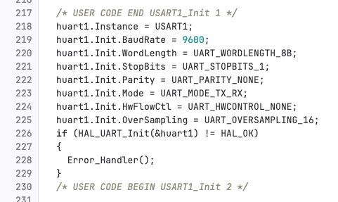
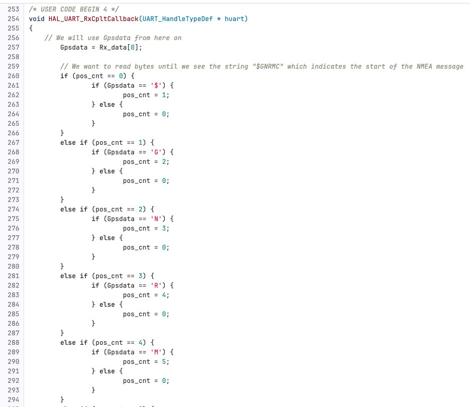
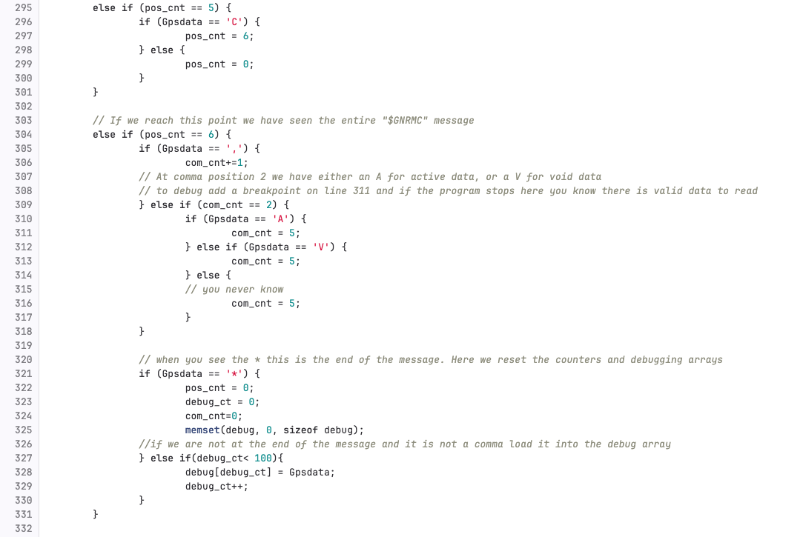

# GPS 23-24

## Name

GPS code to put onto the telemetry board for Illini EV Concept created by Zachary Takiff and Alex Camaj

## Description

The current state of the code will read in data byte by byte from the GPS chip (over UART) and we have set up debugging to test whether the incoming data is Active of Void. Once we can get the hardware working the next step is to pull out latitude, longitude and number of satellites out of the message. This data will be sent over CAN and can be processed over telemetry to map out car location and signal strength.

## Code Overview

### Starting from the top we have a lot of private variables to declare in order to process incoming NMEA messages

- `Rx_data` - Our main storage array we use to store incoming data _(only needs to really hold one byte but useful to make larger if you need to debug)_
- `debug` - Secondary debugging array we use to look at incoming NMEA message structure
- `debug_ct` - Counter used to manage debug array

- `Gpsdata` - In our callback function used to store the single byte of GPS data we are processing
- `finish` - **NOT IN USE** Could be useful to mark when an entire NMEA message has been parsed _(NMEA messages end in a '\*')_
- `pos_cnt` - When reading NMEA message byte by byte this counter keeps track of how many matching bytes we have seen so far _(if the target string is "$GNGGA" and pos_cnt = 3 we have seen "$GN" and are looking to match when the next byte is 'G')_
- `lat_cnt` - **NOT IN USE** Should be used to load longitude readings into a longitude array
- `lon_cnt` - **NOT IN USE** Should be used to load longitude readings into a longitude array
- `com_cnt` - Once we are sure we have matched the correct message header ($GNGGA) the attached data is comma seperated. You know what data you are reading by how many commas you have read so far.

- `lat` - Store latitude here
- `lon` - Store longitude here
- `num_SV` - Store number of satilites that provided the data here _(can be used as an indicator of how reliable readings are)_
- `i` - **NOT IN USE** Maybe was used in the tutorial code can remove if not needed
- `dir, dir1` - **NOT IN USE** Will be used to store N/S and E/W directions depending to represent GPS coordinates

### Next I'll explain breifly the main code loop behavior and how the code where UART is setup

In main we init UART communciation and use that Hardware Abstraction Layer _HAL_ to trigger our callback function when there a single byte sent from the GPS chip

This is our UART communication init it is easier to just change the .ioc file and autogenerate this code

### For our callback function we are going to first match on a NMEA sentance header, on a match we check the Active/void flag, and load the entire message into a debug array

The first 6 if/else statements are used to match the NMEA sentace header _(GNRMC right now but could be GNGGA if we want number of satellites)_

If we see the correct byte at position x we increment the position counter and continue matching otherwise we need to reset pos_cnt to 0 since our match is incorrect.

Once pos_cnt equals 6 we know we have matched the entire header. Now we use the comma counter to pull out relevent data from the rest of the message.

In our code we look at comma position 2 where the Active/Void flag is. This block is a useful debugging tool as if you add a breakpoint inside the (GPSdata == 'A') branch you now have a program that will pause when it receives valid data from the GPS chip. This means you can run the program outside and if it never pauses _(reaches this branch)_ you know that something is broken and the flag is always Void.

The last branch lets us load the enire message into the debug array until we see the end of message character '_'. When we see '_' remember to reset the relevent variables
**There is another `HAL_UART_Receive_IT(&huart1, Rx_data, 1);` at the very end of the callback this is used to tell the program to wait for the next byte after processing the current one**

## Getting started

To run this project in STM32CubeIDE clone this repo to your computer then follow these steps

In STM32CubeIDE go to files and select import

In the import menu select "Existing Projects into Workspace"

Using default settings set root directory to the GPS folder within your cloned repoitory.
Select finish to complete the import process

## Problems

So far only incoming data from the chip is marked as "void" regardless of being inside/outside (see docs for active vs void data flags). So far these issues have been hardware related. One case is that the telemetry board is currently shorting on ground and 3.3V so we will need working hardware to get it into a workable state.

## Further Documention

See on microsoft teams "Embedded/GPS" folder for related datasheets and further documentation about the GPS project, code, and hardware datasheets
