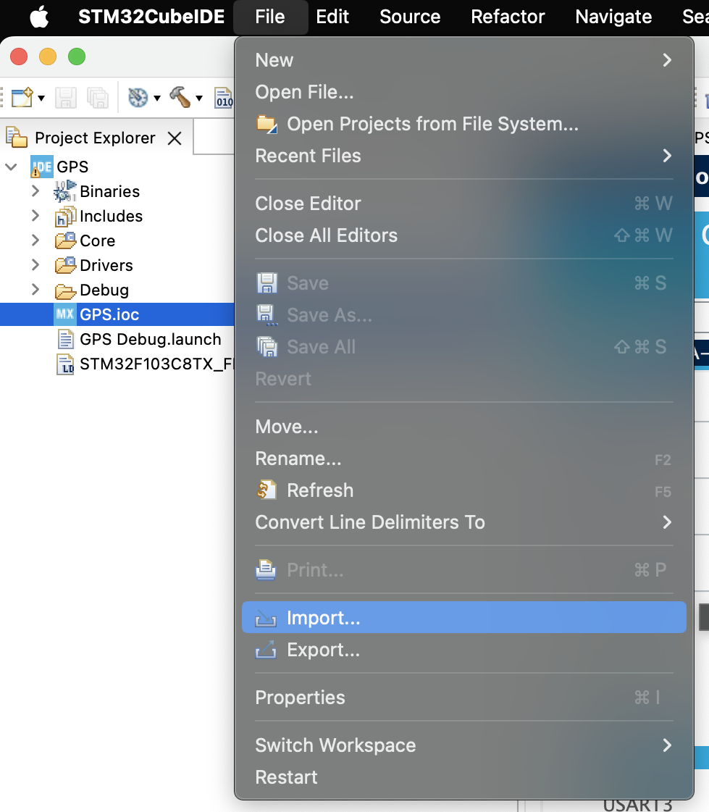
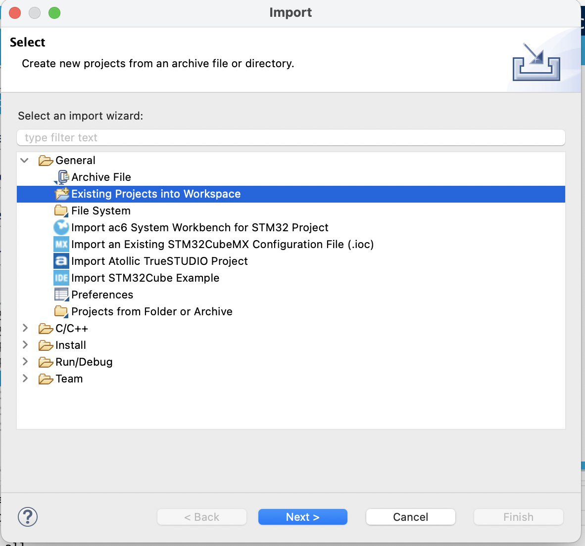
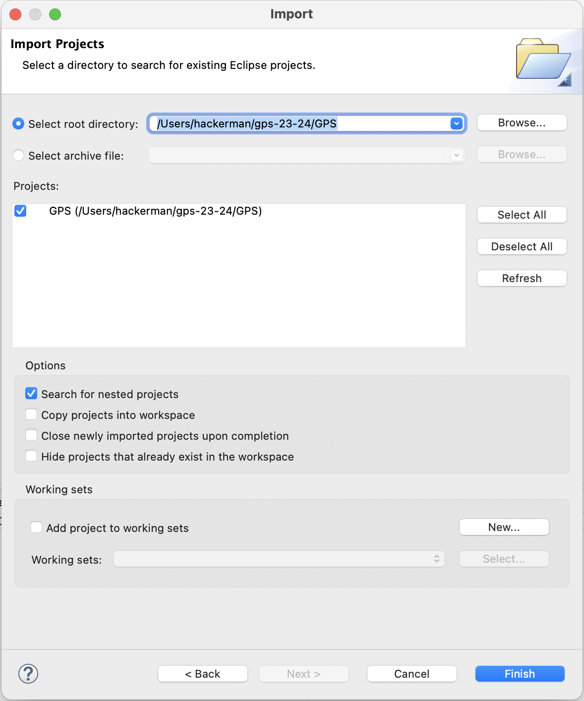

# GPS 23-24

## Name

GPS code to put onto the telemetry board for Illini EV Concept created by Zachary Takiff and Alex Camaj

## Description

The current state of the code will read in data byte by byte from the GPS chip (over UART) and we have set up debugging to test whether the incoming data is Active of Void. Once we can get the hardware working the next step is to pull out latitude, longitude and number of satellites out of the message. This data will be sent over CAN and can be processed over telemetry to map out car location and signal strength.

## Getting started

To run this project in STM32CubeIDE clone this repo to your computer then follow these steps

In STM32CubeIDE go to files and select import

In the import menu select "Existing Projects into Workspace"

Using default settings set root directory to the GPS folder within your cloned repoitory.
Select finish to complete the import process

## Problems

So far only incoming data from the chip is marked as "void" regardless of being inside/outside (see docs for active vs void data flags). So far these issues have been hardware related. One case is that the telemetry board is currently shorting on ground and 3.3V so we will need working hardware to get it into a workable state.

## Further Documention

See on microsoft teams "Embedded/GPS" folder for related datasheets and further documentation about the GPS project, code, and hardware datasheets
